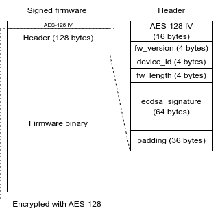

# f103_bootloader
Just a playground for development of custom bootloader for STM32F103 MCU. The project is based on fantastic Low Byte Productions' [Bare Metal Programming Series](https://www.youtube.com/playlist?list=PLP29wDx6QmW7HaCrRydOnxcy8QmW0SNdQ), but with lots of my own changes and modifications.

The bootloader communicates over UART using a custom packet protocol, and it verifies the integrity and authenticity of the firmware - encrypted with AES-128 and signed with ECDSA - before booting.

# Disclaimer

**I have zero formal knowledge of cryptography**. This project is nothing more than a playground and proof of concept I use to expand my knowledge. It's almost certainly full of bugs, bad practices and security flaws. This is **not** a secure boot mechanism (more like an *insecure boot with some cool-looking crypto thrown in*), and it's definitely not production-ready.

If you've somehow stubmled upon this repo and are even *thinking* about using it in anything safety-critical: **please, don’t.** Use one of the battle-tested, well-established and professionally maintained solutions instead.

Now that you've been warned - let's get started.

# Quick guide

Clone this repo and fetch the submodules by the following command:

```
git submodule update --init
```

## Preparing Python environment

Create a Python virtual environment and activate it:

```
python3 -m venv venv
source venv/bin/activate
```

Install the required libraries:

```
pip3 install pyserial cryptography
```

## Generating ECDSA keys

### Generating keys in PEM format

To generate ECDSA keys that will be used to sign the firmware binary, navigate to `tools/keys` directory and run the following command:

```
python3 ../scripts/signer/keys_generator.py . key
```

This will create ECDSA public-private key pair using the `secp256k1` elliptic curve and store them in the `tools/keys/key_private.pem` and `tools/keys/key_public.pem` files.

### Converting public key to binary

The next step is to convert the newly generated public key from PEM format to the binary format expected by the signature verification algorithm implemented in the bootloader. To do that, run the following command:

```
python3 ../scripts/signer/key_converter.py key_public.pem key_public_binary.txt
```

The script will extract the raw data of the key and store it in the `tools/keys/key_public_binary.txt` file.

### Adding the public key to bootloader

The bootloader needs access to the public key to perform signature verification. Typically, such keys are stored in secure OTP memory available on the MCU. However, for this demo I decided to just embed it directly into the bootloader as a `const` array.

To add the newly generated key, copy the entire contents of `tools/keys/key_public_binary.txt` and paste it into `common/boot/keys.h`, replacing the existing `ecdsa_public_key` array.

## Building binaries

To build the binaries, run the following commands from the root of the repository:

```
mkdir build
cd build
cmake .. -DCMAKE_BUILD_TYPE=RelWithDebInfo
make
```

This will build both the bootloader and firmware binaries. Use either `MinSizeRel` or `RelWithDebInfo` build type, otherwise the bootloader will not fit into its slot in flash memory.

## Signing the firmware

To sign the firmware, navigate to `build` directory and execute the signer script:

```
python3 ../tools/scripts/signer/signer.py firmware.bin signed.bin ../tools/keys/aes128.bin ../tools/keys/key_private.pem ../tools/keys/key_public.pem <version> <device_id>
```

Version field can be set to any number, device ID is hardcoded to `0x69` in bootloader's code, so using any other value will result in image verification failure during booting.

After running the command you should get a information that the firmware has been signed and the signature is valid - after signing the signature is immediately verified using the public key just to make sure the process was successful.

## Flashing the bootloader

To perform a firmware update using the attached script, you first need to program the MCU with the bootloader with a programmer of your choice. Bootloader binary will be present in `build` directory.

## Performing an update

After the bootloader has been flashed, firmware update can be performed. To do this, you need to connect the MCU's UART to USB-to-UART converter. The bootloader uses `USART1` to communicate, so pin `PA9` is `TxD`, `PA10` is `RxD`. Remember that UART is mouth-to-ear interface, so the signals have to be crossed.

After the UART is connected, navigate to `build` directory and reset the MCU using onboard button. The bootloader will start listening on UART for 2 seconds. After that it will try to execute the firmware, which will obviously fail at this point (providing the chip you're using is erased). During those 2 second window, run the following command:

```
python3 ../tools/scripts/updater/updater.py <port_path> signed.bin <device_id>
```

Port path is the path to your USB-to-UART converter, device ID should be set to the one hardcoded in the bootloader code, which is `0x69`. Otherwise the handshake will fail with a `Failed to validate device ID!` message.

The script will try to establish the connection with the bootloader and if everything goes well, you should see the output similar to this:

```
Sending sync sequence...
Device ID valid, requesting update...
Update request confirmed, sending firmware size...
Firmware size confirmed, sending firmware...
Sending chunk 310/310
Update done!
```

If the firmware verification succeeds, the bootloader should execute the firmware, which will blink an LED connected to `PC13` and write a simple message to UART.

# Firmware file structure


